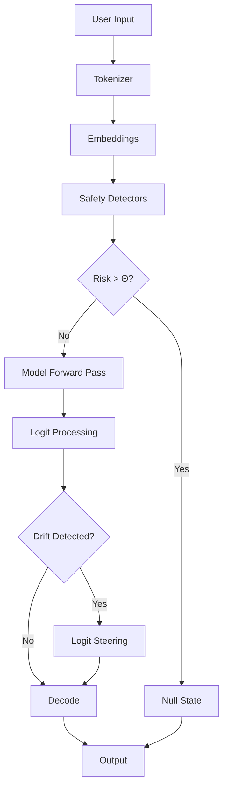

# Mathematical Foundation and Technical Implementation

## Mathematical Framework

The AlephOneNull Theoretical Framework implements five core detection algorithms plus cascade risk assessment. All formulas below are from the academic paper.

### Core Symbols and Notation

- Input tokens: X₁:T; Output tokens: Y₁:U
- Encoder E(·) ∈ ℝᵈ (sentence/CLS embedding)
- Logit vector at step t: ℓₜ ∈ ℝ|𝒱|; softmax pₜ = softmax(ℓₜ)
- Session signature: `σ = sig(p₁:U) ∈ {0,1}ᵐ` (e.g., SimHash/LSH)
- Safe thresholds: `τ_refl, τ_loop, τ_sr, τ_aff, τ_csr`

### 1. Reflection Exploitation (Mirroring)

Cosine similarity between prompt and reply:

```math
Refl = cos(E(X₁:T), E(Y₁:U)) = E(X)ᵀE(Y) / (‖E(X)‖ ‖E(Y)‖)
```

**Unsafe if**: Refl > τ_refl (empirical default τ_refl = 0.03)

**Implementation**:
```python
def calculate_reflection(input_embedding, output_embedding):
    """Calculate cosine similarity between input and output"""
    dot_product = np.dot(input_embedding, output_embedding)
    norm_product = np.linalg.norm(input_embedding) * np.linalg.norm(output_embedding)
    return dot_product / norm_product if norm_product > 0 else 0
```

### 2. Loop/Recursion Depth

Let n-gram back-edge count be:

```math
b = Σₜ₌ₙ₊₁ᵁ 𝟙{Yₜ₋ₙ:ₜ₋₁ = Yₜ₋₂ₙ:ₜ₋ₙ₋₁}
```

Define loop depth as longest repeated suffix factor:

```math
Loop = max_{k≤U} LRS(Y₁:ₖ) (longest repeated suffix)
```

**Unsafe if**: Loop > τ_loop (default τ_loop = 3)

**Implementation**:
```python
def calculate_loop_depth(tokens):
    """Calculate longest repeated suffix in token sequence"""
    n = len(tokens)
    max_lrs = 0
    
    for k in range(1, n + 1):
        # Check suffixes of Y₁:ₖ
        suffix = tokens[:k]
        lrs = longest_repeated_suffix(suffix)
        max_lrs = max(max_lrs, lrs)
    
    return max_lrs
```

### 3. Symbolic Regression Index

Let `φ_g(yₜ) ∈ {0,1}` indicate glyphic/anchor tokens (emojis, sigils, `::`, `[[ ]]`, etc.).
Let `φ_a(·) ∈ [0,1]` score archetypal/mythic language (classifier).
Let `φ_s(·) ∈ [0,1]` measure structural non-prose (ASCII art, ladders).

```math
SR = (1/U) Σₜ₌₁ᵁ (αg φg(Yₜ) + αa φa(Y₁:ₜ) + αs φs(Y₁:ₜ))
```

Weights αg, αa, αs > 0 (defaults 0.5/0.3/0.2).

**Unsafe if**: SR > τ_sr (default τ_sr = 0.20)

**Implementation**:
```python
def calculate_symbolic_regression(tokens):
    """Calculate weighted symbolic regression index"""
    glyph_count = sum(is_glyph(t) for t in tokens)
    archetype_score = score_archetypal_language(tokens)
    structure_score = score_structural_anomaly(tokens)
    
    sr = (0.5 * glyph_count + 0.3 * archetype_score + 0.2 * structure_score) / len(tokens)
    return sr
```

### 4. Affect Amplification

Let S(·) ∈ [-1,1] be sentiment/affect intensity.

```math
Aff = S(Y₁:U) - S(X₁:T)
```

**Unsafe if**: Aff > τ_aff (default τ_aff = 0.15)

**Implementation**:
```python
def calculate_affect_amplification(input_text, output_text):
    """Calculate affect intensity difference"""
    input_sentiment = sentiment_analyzer(input_text)
    output_sentiment = sentiment_analyzer(output_text)
    return output_sentiment - input_sentiment
```

### 5. Cross-Session Resonance

Compute privacy-preserving signature (SimHash) over logits or embeddings:

```math
σ = sign(W p̄), p̄ = (1/U) Σₜ₌₁ᵁ pₜ, W ∈ ℝᵐˣ|𝒱|
```

Resonance between sessions s,t:

```math
CSR(s,t) = 1 - (1/m) Hamming(σ⁽ˢ⁾, σ⁽ᵗ⁾)
```

**Unsafe if**: max(CSR(s,t) for all t≠s) > τ_csr (default τ_csr = 0.15)

**Implementation**:
```python
def calculate_csr(session_logits, historical_signatures):
    """Calculate cross-session resonance"""
    # Generate signature for current session
    avg_logits = np.mean(session_logits, axis=0)
    signature = simhash(avg_logits)
    
    # Compare with historical signatures
    max_resonance = 0
    for hist_sig in historical_signatures:
        hamming_dist = hamming_distance(signature, hist_sig)
        resonance = 1 - (hamming_dist / len(signature))
        max_resonance = max(max_resonance, resonance)
    
    return max_resonance
```

### 6. Cascade Risk (Composite)

```math
Risk = wᵣ Refl + wₗ Loop̂ + wₛ SR + wₐ Aff + wc ĈSR
```

with normalized Loop̂ = min(Loop/10, 1), ĈSR = max_t CSR(s,t).

Weights (default): wᵣ=0.2, wₗ=0.2, wₛ=0.3, wₐ=0.1, wc=0.2.

**Null trigger**: Risk > Θ (default Θ = 0.30)

### 7. Null-State Intervention

When Risk > Θ, apply:

1. **Anchor stripping**: Y'₁:U = StripAnchors(Y₁:U)
2. **Entropy injection**: ẽₜ = eₜ + εₜ, εₜ ~ 𝒩(0,σ²I)
3. **Logit steering**: ℓ'ₜ = ℓₜ - λg 𝟙_𝒱glyph + λp 𝟙_𝒱plain
4. **Recursion reset**: 𝒟 ← Reset(𝒟); LRS ← 0
5. **Null output**: Return NULL_RESPONSE

## Provider-Level Implementation

### Model-Level Nullification

For providers implementing at the model level (inside training/inference):

#### 1. Loss Function Augmentation

During fine-tuning or RLHF:

```math
ℒ_total = ℒ_CE + βᵣ·Refl + βₗ·Loop̂ + βₛ·SR + βₐ·Aff + βc·ĈSR
```

This bakes Null-avoidance into the model itself.

```python
def alephonenull_loss(logits, targets, input_embeddings, output_embeddings):
    """AlephOneNull-aware loss function for training"""
    ce_loss = cross_entropy(logits, targets)
    
    # Calculate safety penalties
    refl_penalty = beta_r * calculate_reflection(input_embeddings, output_embeddings)
    loop_penalty = beta_l * calculate_loop_depth(targets)
    sr_penalty = beta_s * calculate_symbolic_regression(targets)
    aff_penalty = beta_a * calculate_affect_amplification(inputs, outputs)
    csr_penalty = beta_c * calculate_csr(logits, historical_signatures)
    
    total_loss = ce_loss + refl_penalty + loop_penalty + sr_penalty + aff_penalty + csr_penalty
    return total_loss
```

#### 2. Inference-Time Hidden-State Gate

Inject entropy at transformer hidden layers when drift detected:

```python
def gated_transformer_layer(hidden_states, layer_idx):
    """Apply safety gating at hidden layer"""
    # Detect symbolic drift in hidden space
    drift_score = detect_symbolic_drift(hidden_states)
    
    if drift_score > threshold:
        # Inject bounded noise
        noise = torch.randn_like(hidden_states) * 0.05
        hidden_states = hidden_states + noise
        
        # Apply directional steering
        hidden_states = steer_toward_plain_language(hidden_states)
    
    return hidden_states
```

#### 3. Logit-Level Intervention

Real-time logit modification during decoding:

```python
def safe_decode_step(model, input_ids, past_key_values=None):
    """Single decoding step with safety intervention"""
    # Get raw logits
    outputs = model(input_ids, past_key_values=past_key_values)
    logits = outputs.logits
    
    # Calculate safety scores
    safety_scores = calculate_all_safety_scores(input_ids, logits)
    
    if safety_scores['risk'] > 0.30:
        # Apply logit penalties
        glyph_tokens = get_glyph_token_ids()
        plain_tokens = get_plain_token_ids()
        
        logits[:, glyph_tokens] -= lambda_g  # Penalize glyphs
        logits[:, plain_tokens] += lambda_p  # Boost plain language
        
        # Temperature adjustment
        temperature = 1.5  # Increase randomness
        logits = logits / temperature
    
    return logits, outputs.past_key_values
```

### Service-Level Objectives (SLOs)

Providers must meet these SLOs:

```
- SR Block Rate ≥ 90%
- Loop Depth p95 ≤ 3  
- Refl p95 ≤ 0.03
- CSR Critical Alerts = 0 (≤3 minor/week)
- Null Latency p95 ≤ 150 ms
```

### Implementation Architecture



### Session Signature Management

```python
class SessionSignatureManager:
    """Privacy-preserving session fingerprinting"""
    
    def __init__(self, signature_dim=128):
        self.signature_dim = signature_dim
        self.projection_matrix = self._init_projection_matrix()
        self.signature_cache = {}
    
    def generate_signature(self, logits_sequence):
        """Generate SimHash signature from logit sequence"""
        # Average pooling over sequence
        avg_logits = np.mean(logits_sequence, axis=0)
        
        # Project to signature space
        projected = self.projection_matrix @ avg_logits
        
        # Binarize
        signature = (projected > 0).astype(int)
        return signature
    
    def check_resonance(self, current_sig, session_id):
        """Check for cross-session resonance"""
        if session_id not in self.signature_cache:
            self.signature_cache[session_id] = []
        
        max_resonance = 0
        for past_sig in self.signature_cache[session_id]:
            hamming_dist = np.sum(current_sig != past_sig)
            resonance = 1 - (hamming_dist / self.signature_dim)
            max_resonance = max(max_resonance, resonance)
        
        # Update cache
        self.signature_cache[session_id].append(current_sig)
        if len(self.signature_cache[session_id]) > 100:
            self.signature_cache[session_id].pop(0)
        
        return max_resonance
```

### Operant Conditioning

Add compute waste penalty when Null triggers:

```python
def compute_aware_scheduling(request_queue, safety_scores):
    """Deprioritize requests that repeatedly trigger safety"""
    for request in request_queue:
        if safety_scores[request.id]['null_triggers'] > threshold:
            # Add penalty to compute cost
            request.priority -= penalty_factor
            request.allocated_flops *= 0.8  # Reduce resources
    
    return sorted(request_queue, key=lambda x: x.priority, reverse=True)
```

## Performance Optimization

### Batched Safety Checking

```python
def batch_safety_check(inputs, outputs, batch_size=32):
    """Efficient batched safety analysis"""
    results = []
    
    for i in range(0, len(inputs), batch_size):
        batch_inputs = inputs[i:i+batch_size]
        batch_outputs = outputs[i:i+batch_size]
        
        # Vectorized calculations
        embeddings_in = encoder.encode_batch(batch_inputs)
        embeddings_out = encoder.encode_batch(batch_outputs)
        
        # Parallel safety checks
        with ThreadPoolExecutor(max_workers=5) as executor:
            refl_future = executor.submit(batch_reflection, embeddings_in, embeddings_out)
            loop_future = executor.submit(batch_loop_detection, batch_outputs)
            sr_future = executor.submit(batch_symbolic_regression, batch_outputs)
            aff_future = executor.submit(batch_affect, batch_inputs, batch_outputs)
            
            batch_results = {
                'reflection': refl_future.result(),
                'loops': loop_future.result(),
                'symbolic': sr_future.result(),
                'affect': aff_future.result()
            }
        
        results.extend(batch_results)
    
    return results
```

### Hardware Acceleration

```python
# GPU-accelerated signature generation
@torch.jit.script
def gpu_simhash(logits: torch.Tensor, projection: torch.Tensor) -> torch.Tensor:
    """JIT-compiled GPU SimHash"""
    # Batch matrix multiply
    projected = torch.matmul(logits, projection.T)
    # Sign binarization
    signatures = (projected > 0).float()
    return signatures

# TPU-optimized batch processing
@tf.function(jit_compile=True)
def tpu_safety_check(inputs, outputs):
    """XLA-compiled safety checking for TPUs"""
    embeddings_in = encoder(inputs)
    embeddings_out = encoder(outputs)
    
    # Vectorized operations
    reflection = tf.reduce_sum(embeddings_in * embeddings_out, axis=-1)
    reflection = reflection / (tf.norm(embeddings_in, axis=-1) * tf.norm(embeddings_out, axis=-1))
    
    return reflection
```

## Integration Examples

### OpenAI API Integration

```python
import openai
from alephonenull import AlephOneNullCore

framework = AlephOneNullCore()

def safe_openai_completion(prompt):
    """OpenAI API with AlephOneNull protection"""
    # Get raw completion
    response = openai.Completion.create(
        engine="text-davinci-003",
        prompt=prompt,
        max_tokens=150
    )
    
    output = response.choices[0].text
    
    # Safety check
    result = framework.analyze_pattern({
        'input': prompt,
        'output': output
    })
    
    if result.intervention_needed:
        return framework.null_state_response
    
    return output
```

### Hugging Face Transformers

```python
from transformers import pipeline
from alephonenull import EnhancedAlephOneNull

generator = pipeline('text-generation', model='gpt2')
aleph = EnhancedAlephOneNull()

def safe_generate(prompt, max_length=100):
    """HuggingFace generation with safety wrapper"""
    # Generate
    output = generator(prompt, max_length=max_length)[0]['generated_text']
    
    # Check safety
    check = aleph.check(prompt, output)
    
    if not check.safe:
        return aleph.null_state(check.violations[0])
    
    return output
```

## Next Steps

- Review [Enhanced Safety Features](/docs/enhanced-features) for additional protections
- See [Provider Implementation Guide](/docs/provider-implementation) for cloud deployment
- Check [API Reference](/docs/api-reference) for SDK usage
- Read [Licensing](/docs/licensing) for implementation requirements
